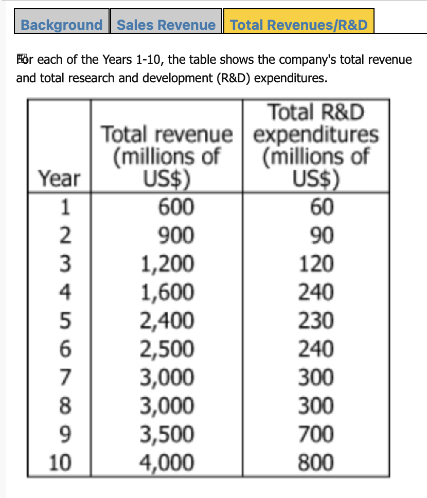

# Customize Your Preferred Problem-Solving Process and Request an AI Demonstration

## Instruction
If the problem-solving order is adjusted as follows: ______, can you help me determine the shortest and most efficient reading path? Please follow human unidirectional thinking.

## Function
Allow candidates to define their own desired order for processing information by specifying how they wish to sequence the review of problem clues and supporting image data.

For test-takers with **[certain traits]**, how should the reading order for three images be adjusted?


## Suitable For
- Candidates who want to personalize their problem-solving strategy by setting a custom sequence for reviewing questions and images.
- Test-takers who feel that the standard reading order does not match their cognitive style and need a tailored approach.
- Those who wish to enhance their practical efficiency by simplifying their thought process and streamlining the path from problem clues to supporting information.

## Example
**Input:**  




```
If the problem-solving order is adjusted as follows: first, review the content of the question:

Based on the information provided, in which one of the following years were the company's combined revenues from sales of Formulas A and B the least?
	Year 5
	Year 6
	Year 7
	Year 8
	Year 9

 And then, based on the clues provided in the question, refer back to the information in the image—can you help me determine the shortest and most efficient reading path? Please follow a human unidirectional thought process.
```

**Output:**  

**Step 1: Read the Question First**
**Question:**
> "Based on the information provided, in which one of the following years were the company's combined revenues from sales of Formulas A and B the least (Year 5, 6, 7, 8, or 9)?"

**Key Point:**
We only need to identify the year between 5 and 9 in which the sum of revenues from Formula A and Formula B is the lowest.

**Step 2: Directly Examine the "Sales Revenue" Chart**

**Reason:**
This chart presents the revenue figures for Formula A and Formula B across all years (1–10) in the most direct and clear manner.

#### **Action:**
- Quickly locate the corresponding revenue bars for **Years 5 to 9** for both **A and B** in the chart.
- Use visual estimation or simple addition (**A + B**) to determine which of the five years has the lowest combined total.
- Note the result.

**Step 3: (If Time Permits) Briefly Review the "Background" Section**

**Reason:**
- To confirm that **Formula B was introduced in Year 5**.
- To verify that **Formula A was under patent protection from Years 1 to 6**, meaning the overlapping period for Years 5–9 should be considered.

**Can Be Skipped:**  
If time is extremely limited, the background information is not essential, as the question only requires identifying the year with the lowest combined revenue for A and B.


**Step 4: (Can Be Skipped) Ignore the "Total Revenues/R&D" Table**

**Reason:**
- This table displays **total company revenue** (including other sources) and **R&D expenses**, rather than breaking down the revenues of **Formula A and B** specifically.
- **Irrelevant to the question:** Since we only need to compare the combined revenue of A and B, this information can be skipped.

**Conclusion**

Following the **"Question → Sales Revenue Chart"** path is the most direct approach. No additional information is needed to determine which year had the lowest combined revenue for Formulas A and B.

**Input:**  
```
For test-takers with weaker reading skills, how should the reading order for three images be adjusted?
```

**Output:**

**Recommended Simplified Reading Order and Rationale**

**Step 1: Directly Read the Sales Revenue Chart**
**Rationale:**
- This chart directly presents the product revenues for each year, allowing for a quick identification of the numerical values required by the question (e.g., which year had the lowest combined revenue).
- It minimizes unnecessary textual descriptions and relies on straightforward numerical comparisons, making it ideal for individuals with weaker reading skills.

**Step 2: Refer to the Background Information (Background Image)**
**Rationale:**
- The background image provides basic information on product sales and patent durations, helping to contextualize the timeline and special years (e.g., when Formula B started sales).
- Only a quick review to confirm key premises is needed; deep reading is unnecessary.

**Step 3: Review the Total Revenues and R&D Chart (Total Revenues/R&D Image)**

**Rationale:**
- This section contains supplementary data, useful only for verifying overall trends or making further comparisons.
- If the question primarily focuses on specific product data, this chart should be reviewed last to avoid diverting attention from key information.

**Summary**

For test-takers with weaker reading abilities, it is recommended to follow a **"question-driven"** strategy. This means prioritizing the most directly relevant data charts first, followed by background and supplementary information as needed. This approach reduces reading load, helps quickly capture key information, and prevents information overload.